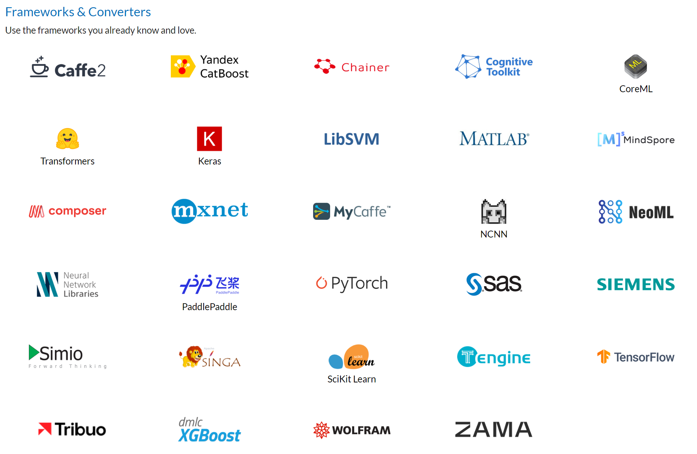
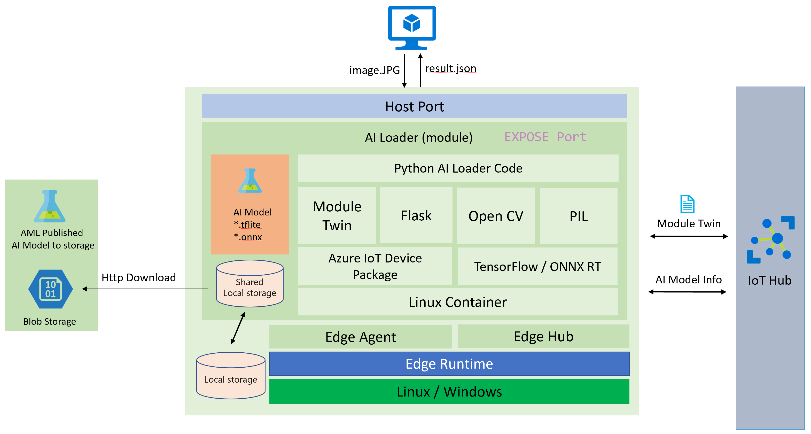

# How To Enable ML Inference Modules On Azure IoT Edge Device

## Background

One of the most popular Edge scenarios is the artificial intelligence (AI) on Edge (Image Classification, Object Detection, Body, Face & Gesture Analysis, Image Manipulation, ETC ... ). Azure IoT Edge can certainly support these scenarios, These AI ability can also be improve over the model update, but in some scenarios the Edge device network environment is not good, Especially for some manufacturing equipment such as wind power or oil exploitation which equipment in the desert or in the sea.

However, as you know, Azure IoT Edge Module is the basis on docker. In generally an Edge module image with the AI environment which size will be around GB level at least, so how to incremental updates the AI model in a narrow bandwidth network its becomes more meaningful. That's why this document was written. The idear is made a Edge AI loader module which can load *Object Detection* TensorFlow or ONNX AI models and enable this AI module as a WebAPI. So that in this way Edge module can benefits other application or module.

## Overview

This document can help you build a Azure IoT Edge Module can download AI model then enable Inference ability. support TensorFlow *.tflite format model or *.onnx (Open Neural Network Exchange) format model.

So for ML Inference Modules have some Key concepts need to be clarify first (If you are not familiar with AI, you can learn the basics knowledge of TensorFlow lite and ONNX in the following two sections).

### TensorFlow

1. AI Model File: *.tflite its pre-trained AI model which download from [TensorFlow.org - Download starter model with Metadata](https://www.tensorflow.org/lite/examples/object_detection/overview) and its a generic AI model format that can be used in cross-platform applications such as IOS and Android. And about more information about Metadata and associated fields (eg: labels.txt) see [Read the metadata from models](https://www.tensorflow.org/lite/convert/metadata#read_the_metadata_from_models)
2. Model description： An object detection model is trained to detect the presence and location of multiple classes of objects. For example, a model might be trained with images that contain various pieces of fruit, along with a label that specifies the class of fruit they represent (e.g. an apple, a banana, or a strawberry), and data specifying where each object appears in the image.

    When an image is subsequently provided to the model, it will output a list of the objects it detects, the location of a bounding box that contains each object, and a score that indicates the confidence that detection was correct.
3. In case of if you want to build or customize tuning an AI Model please see [TensorFlow Lite Model Maker](https://www.tensorflow.org/lite/guide/model_maker)
4. More free pre-trained detection models with a variety of latency and precision characteristics can be found in the [Detection Zoo](https://github.com/tensorflow/models/blob/master/research/object_detection/g3doc/tf1_detection_zoo.md#mobile-models). Each one of them follows the input and output signatures described in the following sections.

### Open Neural Network Exchange (ONNX)

Open Neural Network Exchange (ONNX) is an open standard format for representing machine learning models. ONNX is supported by a community of partners who have implemented it in many frameworks and tools.

1. ONNX supports a variety of tools to Build and deploy models and Frameworks & Converters [Build / Deploy Model](https://onnx.ai/supported-tools.html)
2. You can use ONNX runtime run ONNX Pre-Trained Models [ONNX Model Zoo](https://github.com/onnx/models) for implementation Vision Language Other AI features
3. In this case you can use model of [Object Detection & Image Segmentation - Tiny YOLOv3](https://github.com/onnx/models/tree/master/vision/object_detection_segmentation/tiny-yolov3)


The ONNX community provides tools to assist with creating and deploying your next deep learning model. Use the information below to select the tool that is right for your project.


### The dynamically loaded AI model base on the features of IoT Edge module Twin, the architecture please refer below and work steps:

1. Upload Pre-Trained AI Models to public blob storage (Or any other Web service, just for the Edge Module can access this resource and download to Edge device later)
2. The IoT Hub will sync device module twins automatically with AI Models information, the sync will be done even if IoT Edge offline for some time.
3. The Loader Module monitors the updates of module twins via SDK. Through this way, it can get the ML model SAS token, and then download the AI model.
4. The Loader Module saves the AI model in the shared local storage of the IoT Edge Module. The local storage needs to be configured in the IoT Edge deployment JSON file.
5. The Loader Module load the AI model from the local storage by TensorFlow/ONNX SDK.
6. The Loader Module starts a Web API that receives the binary photo via post request and returns results in json file

In case for update AI model we can upload new AI model to blob storage and sync device module twins again instead of update whole IoT Edge module image, so this is the AI model incremental updates.



### Download trained AI model

Here I recommend using device twin to receive notifications that a new model is ready. Even when the device is offline, the message can still be cached in the IoT Hub to wait for the Edge device come back, and the message will be automatically synchronized.

Here is a code example of the python code used to register notifications for device twin then download AI model as a zip package. And perform further operations on the downloaded file.

1. The device twin notification was received, which included the file name(File name You can include version information such as 1.0, 1.1, or 2.0), file download address, and MD5 authentication token.
2. Download AI model as zip file to local storage.
3. MD5 checksum (optional) MD5 verification is prevent zip files being tampered during the network transmission.
4. Unzip it and save it locally.
5. Send notifications to IoT Hub or routing message to inform that the new AI model is ready.

```python
# define behavior for receiving a twin patch
async def twin_patch_handler(patch):
    try:
        print( "######## The data in the desired properties patch was: %s" % patch)
        if "FileName" in patch:
            FileName = patch["FileName"]
        if "DownloadUrl" in patch:
            DownloadUrl = patch["DownloadUrl"]
        if "ContentMD5" in patch:
            ContentMD5 = patch["ContentMD5"]
        FilePath = "/iotedge/storage/" + FileName

        # download AI model
        r = requests.get(DownloadUrl)
        print ("######## download AI Model Succeeded.")
        ffw = open(FilePath, 'wb')
        ffw.write(r.content)
        ffw.close()
        print ("######## AI Model File: " + FilePath)

        # MD5 checksum
        md5str = content_encoding(FilePath)
        if md5str == ContentMD5:
            print ( "######## New AI Model MD5 checksum succeeded")
            # decompressing the ZIP file
            unZipSrc = FilePath
            targeDir = "/iotedge/storage/"
            filenamenoext = get_filename_and_ext(unZipSrc)[0]
            targeDir = targeDir + filenamenoext
            unzip_file(unZipSrc,targeDir)
            
            # ONNX
            local_model_path = targeDir + "/tiny-yolov3-11.onnx"
            local_labelmap_path = targeDir + "/coco_classes.txt"

            # TensorFlow flite
            # local_model_path = targeDir + "/ssd_mobilenet_v1_1_metadata_1.tflite"
            # local_labelmap_path = targeDir + "/labelmap.txt"

            # message to module
            if client is not None:
                print ( "######## Send AI Model Info AS Routing Message")
                data = "{\"local_model_path\": \"%s\",\"local_labelmap_path\": \"%s\"}" % (filenamenoext+"/tiny-yolov3-11.onnx", filenamenoext+"/coco_classes.txt")
                await client.send_message_to_output(data, "DLModelOutput")
                # update the reported properties
                reported_properties = {"LatestAIModelFileName": FileName }
                print("######## Setting reported LatestAIModelName to {}".format(reported_properties["LatestAIModelFileName"]))
                await client.patch_twin_reported_properties(reported_properties)
        else:
            print ( "######## New AI Model MD5 checksum failed")

    except Exception as ex:
        print ( "Unexpected error in twin_patch_handler: %s" % ex )
```

### Inference Procedure

After the download of the AI model the next step is to use the model on the Edge device, we can dynamic loading and *Object Detection* on Edge devices. 
The fllow code can help us use the TensorFlow AI model do *Object Detection* on Edge device.

1. Dynamic load TensorFlow flite AI MODEL.
2. Image standardization.
3. Object detection
4. Detection scores for the result

```python
class InferenceProcedure():
    
    def detect_object(self, imgBytes):

        results = []
        try:
            model_full_path = AI_Model_Path.Get_Model_Path()
            if(model_full_path == ""):
                raise Exception ("PLEASE SET AI MODEL FIRST")
            if '.tflite' in model_full_path:
                interpreter = tf.lite.Interpreter(model_path=model_full_path)
                interpreter.allocate_tensors()
                input_details = interpreter.get_input_details()
                output_details = interpreter.get_output_details()
                input_shape = input_details[0]['shape']

                # bytes to numpy.ndarray
                im_arr = np.frombuffer(imgBytes, dtype=np.uint8)
                img = cv2.imdecode(im_arr, flags=cv2.IMREAD_COLOR)
                im_rgb = cv2.cvtColor(img, cv2.COLOR_BGR2RGB)
                im_rgb = cv2.resize(im_rgb, (input_shape[1], input_shape[2]))
                input_data = np.expand_dims(im_rgb, axis=0)

                interpreter.set_tensor(input_details[0]['index'], input_data)
                interpreter.invoke()
                output_data = interpreter.get_tensor(output_details[0]['index'])
                detection_boxes = interpreter.get_tensor(output_details[0]['index'])
                detection_classes = interpreter.get_tensor(output_details[1]['index'])
                detection_scores = interpreter.get_tensor(output_details[2]['index'])
                num_boxes = interpreter.get_tensor(output_details[3]['index'])

                label_names = [line.rstrip('\n') for line in open(AI_Model_Path.Get_Labelmap_Path())]
                label_names = np.array(label_names)
                new_label_names = list(filter(lambda x : x != '???', label_names))

                for i in range(int(num_boxes[0])):
                    if detection_scores[0, i] > .5:
                        class_id = int(detection_classes[0, i])
                        class_name = new_label_names[class_id]
                        # top,	left,	bottom,	right
                        results_json = "{'Class': '%s','Score': '%s','Location': '%s'}" % (class_name, detection_scores[0, i],detection_boxes[0, i])
                        results.append(results_json)
                        print(results_json)
        except Exception as e:
            print ( "detect_object unexpected error %s " % e )
            raise

        # return results
        return json.dumps(results)
```

For the ONNX version the process steps are exactly the same, here is the sample code for ONNX, the only difference is how to handling scores result, because the Labelmap and model output parameters are different.

```python
class InferenceProcedure():

    def letterbox_image(self, image, size):
        '''resize image with unchanged aspect ratio using padding'''
        iw, ih = image.size
        w, h = size
        scale = min(w/iw, h/ih)
        nw = int(iw*scale)
        nh = int(ih*scale)

        image = image.resize((nw,nh), Image.BICUBIC)
        new_image = Image.new('RGB', size, (128,128,128))
        new_image.paste(image, ((w-nw)//2, (h-nh)//2))
        return new_image

    def preprocess(self, img):
        model_image_size = (416, 416)
        boxed_image = self.letterbox_image(img, tuple(reversed(model_image_size)))
        image_data = np.array(boxed_image, dtype='float32')
        image_data /= 255.
        image_data = np.transpose(image_data, [2, 0, 1])
        image_data = np.expand_dims(image_data, 0)
        return image_data

    def detect_object(self, imgBytes):
        results = []
        try:
            model_full_path = AI_Model_Path.Get_Model_Path()
            if(model_full_path == ""):
                raise Exception ("PLEASE SET AI MODEL FIRST")
            if '.onnx' in model_full_path:

                # input
                image_data = self.preprocess(imgBytes)
                image_size = np.array([imgBytes.size[1], imgBytes.size[0]], dtype=np.float32).reshape(1, 2)

                labels_file = open(AI_Model_Path.Get_Labelmap_Path())
                labels = labels_file.read().split("\n")

                # Loading ONNX model
                print("loading Tiny YOLO...")
                start_time = time.time()
                sess = rt.InferenceSession(model_full_path)
                print("loaded after", time.time() - start_time, "s")

                input_name00 = sess.get_inputs()[0].name
                input_name01 = sess.get_inputs()[1].name
                pred = sess.run(None, {input_name00: image_data,input_name01:image_size})
 
                boxes = pred[0]
                scores = pred[1]
                indices = pred[2]

                results = []
                out_boxes, out_scores, out_classes = [], [], []
                for idx_ in indices[0]:
                    out_classes.append(idx_[1])
                    out_scores.append(scores[tuple(idx_)])
                    idx_1 = (idx_[0], idx_[2])
                    out_boxes.append(boxes[idx_1])
                    results_json = "{'Class': '%s','Score': '%s','Location': '%s'}" % (labels[idx_[1]], scores[tuple(idx_)],boxes[idx_1])
                    results.append(results_json)
                    print(results_json)

        except Exception as e:
            print ( "detect_object unexpected error %s " % e )
            raise

        # return results
        return json.dumps(results)
```

Well if your IoT Edge Device incorporates the above code and features, then congratulations, your Edge device has AI image object detection capability and supports dynamic updating of AI models.
So next, if you want the Edge module to be able to provide AI ablity to other applications or modules as Web API then you can create a Web API in your module. 

Flask framework, for example, allows you to build an API quickly. You can receive images as binary then use AI model for detection, and return results in json format.

Lean more about Flask: [Flask Tutorial in Visual Studio Code](https://code.visualstudio.com/docs/python/tutorial-flask)

## Reference

- [Understand and use module twins in IoT Hub](https://docs.microsoft.com/en-us/azure/iot-hub/iot-hub-devguide-module-twins)
- [Learn how to deploy modules and establish routes in IoT Edge](https://docs.microsoft.com/en-us/azure/iot-edge/module-composition?view=iotedge-2020-11)
- [Building Azure IoT Edge Module with Message Routing 101](https://tsmatz.wordpress.com/2019/10/19/azure-iot-hub-iot-edge-module-container-tutorial-with-message-route/)
- [Give modules access to a device's local storage](https://docs.microsoft.com/en-us/azure/iot-edge/how-to-access-host-storage-from-module?view=iotedge-2020-11#link-module-storage-to-device-storage)
- [Add local storage to Azure IoT Edge modules using Docker Bind](https://sandervandevelde.wordpress.com/2021/01/07/add-local-storage-to-azure-iot-edge-modules-using-docker-bind/)
- [Understand IoT Edge automatic deployments for single devices or at scale](https://docs.microsoft.com/en-us/azure/iot-edge/module-deployment-monitoring?view=iotedge-2020-11)
- [Open Neural Network Exchange](https://github.com/onnx/)
- [ONNX Tutorials](https://github.com/onnx/tutorials)
- [Deploy ML model on IoT and edge devices](https://github.com/microsoft/onnxruntime/blob/gh-pages/docs/tutorials/iot-edge.md)
